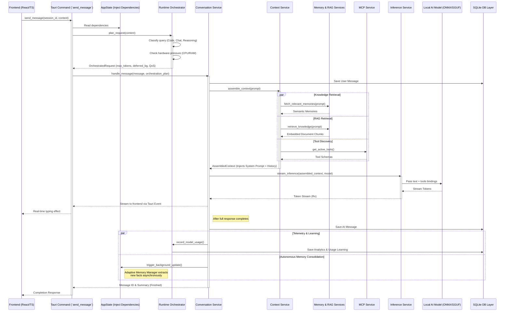

# Sarah Rust Backend Architecture Documentation

This document provides an in-depth overview of the Rust backend architecture for the Sarah AI application. The backend is built on top of [Tauri](https://tauri.app/), leveraging Rust for high performance, system-level integrations, and local AI model inference.

---

## 🏗️ 1. High-Level Architecture

The backend follows a strict **Layered (N-Tier) Architecture** to separate concerns:

1. **Commands Layer (API)**: Located in `src/commands/`. These are Tauri `#[command]` functions that expose backend capabilities to the frontend via IPC.
2. **Services Layer (Business Logic)**: Located in `src/services/`. This layer contains the core application logic, orchestrations, background jobs, and integrations with external processes (like locally running LLMs).
3. **Repository Layer (Data Access)**: Located in `src/repositories/`. Abstracts the database interactions, providing a clean API for services to perform CRUD operations on entities.
4. **Database Layer**: Located in `src/db/`. Handles schema definitions, migrations, and raw connection pooling (via `sqlx` and SQLite).
5. **State Management**: Orchestrated in `src/state.rs`. An `AppState` struct holds thread-safe references (`Arc`) to all repositories, services, caches, and the database pool, injected into every Tauri command.

---

## 📂 2. Core Application Files

### `src/main.rs`
The entry point of the Rust binary. It simply triggers the `run()` function from the library crate.

### `src/lib.rs`
The core setup file. It is responsible for:
- Initializing tracing and logging.
- Building the Tauri application instance.
- Running the `AppState::initialize` block.
- Registering all API commands via `.invoke_handler(tauri::generate_handler![...])`.
- Registering Tauri plugins (like opener and global shortcuts).

### `src/state.rs`
The "Dependency Injection" container and State holder.
- **`AppCache`**: Holds in-memory caches (using `moka::future::Cache`) for hardware profiles, models, user settings, session metadata, recent memories, and text embeddings to ensure fast reads.
- **`AppState`**: Holds the database connection, hardware tier information (`DeviceTier`, `TierConfig`), caches, repositories, and services. `AppState::initialize` bootstraps every single service based on the detected hardware profile.

### `src/error.rs`
Contains the definition of the custom `AppError` enum using `thiserror`. It maps database errors, IO errors, and business logic errors to a uniform format that can be serialized and sent to the frontend.

### `src/native_capture.rs`
A specialized module providing low-level, OS-native screen recording and screenshot capture capabilities.

---

## 🗄️ 3. Database & Models (`src/db/`)

The application uses **SQLite** through **SQLx**. 
- **`models.rs`**: Defines all the Data Transfer Objects (DTOs) and Database entities. Key entities include:
  - `SystemProfile` / `BenchmarkResult`: Hardware specifications and capabilities.
  - `Model` / `ModelWithScore`: Local LLM definitions, usage stats, and recommendations.
  - `Session` / `Message` / `ToolCall`: Chat histories, context usage, and tool executions.
  - `Memory` / `MemoryRelation` / `MemoryGraph`: Agentic semantic memory storage mapping facts and relations.
  - `Document` / `Chunk` / `EmbeddingRow`: RAG (Retrieval-Augmented Generation) document structures and high-dimensional vector embeddings.
  - `Mcp` / `McpUsageStat`: **Model Context Protocol** configuration and usage tracking.
  - `RuntimePolicy` / `RoutingDecision` / `PerfLog`: System telemetry and automated routing limits based on system load.

---

## 📦 4. Repository Layer (`src/repositories/`)

Repositories isolate database logic from business logic.
- **`analytics_repo.rs`**: Tracks telemetry, performance benchmarks, and tool usage statistics.
- **`conversation_repo.rs`**: Manages CRUD for `Session` and `Message` models.
- **`document_repo.rs`**: Manages uploaded knowledge base documents and text chunks for RAG.
- **`embedding_repo.rs`**: Handles storage and retrieval of vector embeddings.
- **`mcp_repo.rs`**: Handles Model Context Protocol tools and secret configurations.
- **`memory_repo.rs`**: Manages semantic memories, their graph relations, and decay rates.
- **`model_repo.rs`**: Catalogs installed and available LLMs.
- **`settings_repo.rs`**: Key-value store for user configurations.
- **`system_repo.rs`**: Manages hardware scan histories, setup state, and base system configs.
- **`user_repo.rs`**: Manages user profiles.

---

## 🧠 5. Services Layer (`src/services/`)

The Services layer is the brain of the backend, segmented into specialized domains:

### **System & Hardware Orchestration**
- **`hardware_service.rs`**: Detects system capabilities (CPU, RAM, GPU, CUDA/Metal support) and defines a `DeviceTier` (Minimal, Low, Medium, High).
- **`runtime_governor_service.rs`**: Monitors system pressure (CPU/RAM usage) and scales the application dynamically (e.g., reducing max tokens).
- **`runtime_orchestrator_service.rs`**: Makes intelligent routing decisions per request. It decides context limits, whether to defer tasks to the background, and dynamically enables/disables features (like Adaptive Memory) depending on pressure.
- **`setup_orchestrator_service.rs`**: Manages the first-run onboarding states and hardware checks.
- **`background_service.rs`**: Runs asynchronous background tasks like memory summarization or telemetry uploads if the `DeviceTier` permits.

### **Intelligence & Execution**
- **`inference_service.rs`**: Interfaces with the local LLM runner to execute prompts and stream tokens.
- **`embedding_service.rs`**: Converts text strings into high-dimensional vector embeddings for semantic search.
- **`reranker_service.rs`**: Provides cross-encoder reranking to accurately sort RAG retrieval results.
- **`rag_service.rs`**: Coordinates Document ingestion, vector embedding, and hybrid search (BM25 + Semantic) retrieval.
- **`model_manager_service.rs`**: Auto-loads and manages the lifecycle of local AI models.

### **Memory & Conversational Context**
- **`context_service.rs`**: Assembles the prompt context window by fetching relevant memories, documents, internet search results, and tool schemas.
- **`memory_service.rs`**: Manages the extraction and retrieval of long-term semantic knowledge (Knowledge Graphs).
- **`adaptive_memory_manager.rs`**: A background worker that continually monitors context and updates memory confidence, decays old memories, and finds related memory graphs.
- **`conversation_service.rs`**: The main entry point for a chat request. It orchestrates context assembly, applies the runtime policy, triggers inference, and records the chat in the DB.
- **`intent_service.rs`**: Analyzes user prompts to statically detect intent (e.g., classifying a prompt as a search vs. an instruction).
- **`smart_query_classifier.rs`**: Classifies prompts to determine the optimal compute budget (e.g., `Code`, `Math`, `Creative`).
- **`task_router_service.rs`**: Routes sub-tasks to smaller specialized models if appropriate, preserving primary model compute power.

### **Integrations**
- **`mcp_service.rs`**: Manages dynamic tool integrations supporting the open **Model Context Protocol**.
- **`crypto_service.rs`**: Securely encrypts secrets (like API keys) using OS-level keyrings.

---

## 🔌 6. Exposed APIs (Tauri Commands)

All external communication with the frontend UI happens through these documented APIs (`src/commands/`).

### **A. Chat & Conversation (`chat_commands.rs`, `local_commands.rs`)**
- `greet`, `get_default_user`
- `send_message`: The primary API to interface with the AI. Uses the `ConversationService`.
- `generate_local_response`: Direct model inference without persisting to the DB.
- `create_session`, `list_sessions`, `get_session_messages`, `archive_session`, `search_conversations`: Standard CRUD for chats.
- `get_local_chat_history`, `clear_local_chat_history`

### **B. Model Management (`model_commands.rs`)**
- `list_local_models`, `list_local_models_detailed`, `get_installed_models`: View available models.
- `get_model_catalog`, `get_recommended_models`: Fetch server-side catalogs and get AI-advised models suitable for the user's hardware.
- `get_model_compatibility_score`: Benchmarks a model against the OS hardware.
- `download_local_model`, `start_model_download`, `get_download_progress`: Manages network downloads.
- `set_default_model`, `run_nlp_setup`

### **C. Memory & RAG (`memory_commands.rs`, `rag_commands.rs`)**
- `get_memories`, `search_memories`, `delete_memory`, `pin_memory`, `update_memory`, `get_memory_graph`: Directly manipulate the autonomous long-term semantic memory storage.
- `ingest_document`, `embed_document`, `retrieve_knowledge`: Manage RAG collections.

### **D. System & Runtime Governance (`runtime_commands.rs`, `system_commands.rs`)**
- `get_hardware_profile`, `get_system_stats`, `run_hardware_benchmark`: Hardware monitoring.
- `get_runtime_policy`, `set_runtime_policy`, `get_runtime_profile`: Retrieve or tweak how aggressive the context window and token limitations are based on CPU pressure.
- `get_service_health`, `get_optimization_stats`, `get_startup_telemetry`, `get_performance_dashboard`: Heavy telemetry and diagnostics reporting.
- `run_model_microbenchmark`, `get_model_routing_decision`
- `start_first_run_setup`, `get_setup_status`, `retry_setup_stage`, `skip_quality_upgrade_for_now`: Onboarding sequence managers.

### **E. Model Context Protocol (MCP) Integration (`mcp_commands.rs`, `integration_commands.rs`)**
- `list_mcps`, `install_mcp`, `activate_mcp`, `deactivate_mcp`, `save_mcp_secret`, `test_mcp_connection`, `get_mcp_stats`: CRUD and operation of MCP plugins.
- **Specific Integrations (Spotify)**:
  - `start_spotify_mcp`, `stop_spotify_mcp`, `spotify_mcp_status`, `run_spotify_oauth`, `build_spotify_mcp`, `write_spotify_config`, `run_spotify_tool`

### **F. Native Captures & OS Window Management (`native_capture.rs`, windowing commands)**
- `open_history_window`, `open_settings_window`, `open_models_window`, `open_mcp_window`, `open_audio_window`, `close_audio_window`: Multi-window application spawning.
- `native_capture::list_active_windows`, `take_native_screenshot`, `start_native_screen_recording`, `stop_native_screen_recording`: Screen understanding and capturing.
- `get_default_capture_directory`, `pick_capture_output_directory`, `validate_capture_path`.

### **G. Settings & Analytics (`settings_commands.rs`, `analytics_commands.rs`)**
- `get_setting`, `set_setting`, `list_settings_namespace`.
- `get_recent_perf_logs`, `run_analytics_aggregation`.

---

## 🔄 7. Core Execution Flow (Diagram)

Below is a detailed sequence diagram illustrating the lifecycle of a user prompt (e.g., `send_message`) flowing through the system architecture up to inference and background learning.

